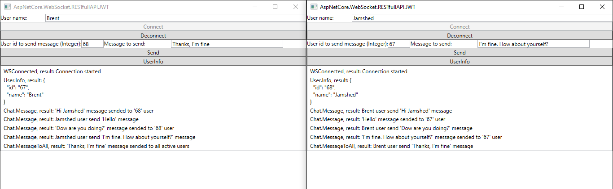

# AspNetCore.WebSocket.RESTfulAPI 
[](https://www.nuget.org/packages/AspNetCore.WebSocket.RESTfulAPI)
[](https://www.nuget.org/packages/AspNetCore.WebSocket.RESTfulAPI)

[](https://www.nuget.org/packages/AspNetCore.WebSocket.RESTfulAPI.JWT)
[](https://www.nuget.org/packages/AspNetCore.WebSocket.RESTfulAPI.JWT)

AspNetCore.WebSocket.RESTfulAPI - is a communication library with Web Socket like RESTful API for ASP.NET Core applications. It is easy to set up and runs on all recent .NET, .NET Framework and .NET Standard platforms. It's used in apps that benefit from fast, real-time communication, such as chat, dashboard, and game applications.


## List of NuGet packages
           
<table>
   <thead>
    <th>№</th>
    <th>Name</th>
    <th>Description</th>
    <th>Endpoints</th>
  </thead>
  <tbody>
    <tr>
        <td align="center">1.</td>
        <td> <a href="https://www.nuget.org/packages/AspNetCore.WebSocket.RESTfulAPI">AspNetCore.WebSocket.RESTfulAPI</a></td>
        <td>This for implementing and using Web Socket on ASP.Net Core to create real-time communication app for building chat, game or other.</td>
        <td> <a href="https://app.swaggerhub.com/apis-docs/mirolimjon/AspNetCore.WebSocket.RESTfulAPI/1.0.0">View</a> </td>
    </tr>
    <tr>
        <td align="center">2.</td>
        <td> <a href="https://www.nuget.org/packages/AspNetCore.WebSocket.RESTfulAPI.JWT/">AspNetCore.WebSocket.RESTfulAPI.JWT</a></td>
        <td>This library also for creating real-time communication app like AspNetCore.WebSocket.RESTfulAPI, but it is customized for using authorized user by JSON Web Token (JWT)</td>
        <td> <a href="https://app.swaggerhub.com/apis-docs/mirolimjon/AspNetCore.WebSocket.RESTfulAPI/1.0.0">View</a> </td>
    </tr>
  </tbody>  
</table>


## Getting Started
### Setup the server

Make sure you have configured [Web Sockets for IIS](https://docs.microsoft.com/en-us/iis/configuration/system.webserver/websocket) in your machine. After that, you need to instal AspNetCore.WebSocket.RESTfulAPI NuGet.

```powershell
Install-Package AspNetCore.WebSocket.RESTfulAPI
```
Add the WebSocket's classes to the services in the ConfigureServices method of the Startup class:
```
services.AddWebSocketManager();
```
Add the `WebSocketRESTfulAPI` middleware in the Configure method of the Startup class:
```
app.WebSocketRESTfulAPI("/WSMessenger");
```
You can configured the Web socket by passing data to needed parameters of WebSocketRESTfulAPI method: <br/>
`Path` - Path to bind Web socket to listen client. Here path is "WSMessenger" and client should cannect to this path "ws://{BaseSiteURL}/WSMessenger". <br/>
`ReceiveBufferSize` - Gets or sets the size of the protocol buffer used to receive and parse frames. The default is 4 kb. Passing this parameter is nor required. <br/>
`KeepAliveInterval` - Gets or sets the frequency at which to send Ping/Pong keep-alive control frames. The default is 60 secunds. Passing this parameter is nor required. <br/>
`LoggAllWebSocketRequestAndResponse` - When you turn on it all request and response data of web socket will be logged to the your configurated file. By default it's false because it can be effect to performance. <br/>

All configuration is done. Now, you able to create your own Web Socket controllers with APIs.<br/> 

First you need to create a new folder which name `Hubs` on project and create new controller for Web socket APIs.

Example code:
```
public class ChatController
{
    private readonly WebSocketHub _socketHub;
    private readonly WSUserInfo _wsUserInfo;
    private readonly ILogger _logger;

    public ChatController(WebSocketHub socketHub, WSUserInfo wsUserInfo, ILogger logger)
    {
        _socketHub = socketHub;
        _wsUserInfo = wsUserInfo;
        _logger = logger;
    }

    //Your APIs  
}
```
 The controller name must be start from `{NameController}Controller` and it should have constructor parameters for `WebSocketHub`, `WSUserInfo` and `ILogger`: <br/>
`WebSocketHub` - This is will be use for sending data by notification to another needed users or for getting acces to the WebSocketManager to get all active client with users data. It can be sub class of WebSocketHub if you want to override (See example from AspNetCore.WebSocket.RESTfulAPI.JWT project to override).<br/>
`WSUserInfo` - To get needed user info which we attach on creating Web socket. It can be sub class of WSUserInfo if you want to override user data and add some other user information to this parameter (See example from AspNetCore.WebSocket.RESTfulAPI.JWT project to create sub class and to use it).<br/>
`ILogger` - This is just for adding logg if it's needed.

Example to create API:
```
[WSHubMethodName("Chat.Message")]
public async Task<ResponseModel> MessageWithFriend(Guid userId, string message)
{
    await _socketHub.SendNotificationAsync(userId, $"{_wsUserInfo.Name} user send '{message}' message", "Chat.Message");
    return await ResponseModel.SuccessRequestAsync($"'{message}' message sended to '{userId}' user");
}
```

Here `WSHubMethodName` to pass full name of API. First one must be controller name and last one must be API name, and both of them should be pass with `.`. The parameters of method should be different dependent of your logic and each parameter can be optional.<br/>
The method of response type must be `ResponseModel`. ResponseModel class has some needed helper method to reponse just by passing needed data to `SuccessRequestAsync` method or `NoAccessAsync` to return error.<br/>
By using `SendNotificationAsync` method of WebSocketHub, you be able to send data by notification to the another user. It will accept UserId, list of UserId or WebSocket connection to send notification.<br/>
Also, you able to use `SwaggerDoc` on Web Socket controller and APIs.

### Setup the client
All configurations of client same other Web Socket client connection except Headers, becasue Headers of client must have information for `UserName` and `UserId`:<br/>
`UserName` - Header's value should be string.<br/>
`UserId` - Header's value can be anything (Guid, Integer, String ...), but it must be unique.


## Result
You can find example for both NuGets from [Test folder](https://github.com/MirolimMajidov/WebSocket.RESTfulAPI/tree/master/tests)<br/>
<center></center>

## Override
See example from [AspNetCore.WebSocket.RESTfulAPI.JWT](https://github.com/MirolimMajidov/WebSocket.RESTfulAPI/tree/master/src/AspNetCore.WebSocket.RESTfulAPI.JWT) project to override AspNetCore.WebSocket.RESTfulAPI's some classes and methods and events like `OnConnectedAsync`, `OnDisconnectedAsync` and other.

## Support
Did you like this NuGet package? If it's helpful for you, supporting by buying me a coffee.

<a href="https://www.buymeacoffee.com/MirolimMajidov" target="_blank" style="max-width: 170px;"></a>
